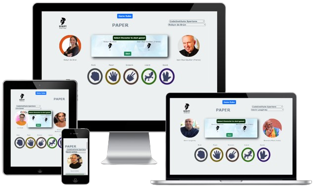

<!--
*** Thank you for checking out and/or using this project. If you have a suggestion
*** that would make this better, please fork the repo and create a pull request
*** or simply open an issue with the tag "improvement".
*** Don't forget to give the project a star!
-->

<!-- PROJECT LOGO -->
 

  <a href="https://github.com/scientistigwe/README-Template">
    
    
   
  

 
 
  <h1 align="center">SCRIPT SPARTANS GAME</h1>

  

    This is a documentation of RPSLS game also code named as Spartan war.
     
     
    <a href="https://github.com/UsmanButt1/script-spartans/blob/main/README.md"><strong>Explore the docs »</strong></a>
     
     

<!-- TABLE OF CONTENTS -->

Table of Contents

<!-- INTRODUCTION SECTION -->

  

  
<a href="#introduction">SECTION 1: INTRODUCTION</a>

        <li><a href="#about-the-project">About The Project</a>
        <li><a href='#ux'>User Experience (UX)</a></li>
        <li><a href='#user-stories'>User Stories</a></li>
        <li><a href="#technology-stack">Technology Stack</a></li>
        <li><a href="#languages-frameworks-libraries">Languages, Frameworks and Libraries</a></li>
        <li><a href="#management-and-development">Project Management and Development Approach</a></li>
    

    <!-- PROJECT SETUP SECTION -->
    

    
<a href="#project-setup">SECTION 2: PROJECT SETUP</a>

    

    

    
<a href="#features-and-structure">SECTION 3: PROJECT FEATURES AND STRUCTURE

    <li><a href="#features">Features</a></li>
        <li><a href="#structure-and-navigation">Structure and Navigation</a></li>
        <li><a href="#wireframes">Wireframes</a></li>
         <li><a href="#design-and-styling">Design and Styling</a>
        <ol>
            <li><a href="#design">Design</a></li>
            <li><a href="#color">Color</a></li>
            <li><a href="#font">font</a></li>
        </ol>
        </li>

<a href="#testing-and-validation">SECTION 4: TESTING AND VALIDATION</a>

    <li><a href="#testing">Testing</a></li>
        <li><a href="#validation">Validation</a>
        <ol>
        <li><a href="#html-validator-report">HTML Validator Report</a></li>
        <li><a href="#css-validator-report">CSS Validator Report</a></li>
        </ol>
        </li>
        <li><a href="#user-story-testing">User Story Testing</a></li>
        <li><a href="#bugs-and-issues">Bugs and Issues</a></li>

<a href="#deployment-and-credits">SECTION 5: DEPLOYMENT AND CREDITS</a>

        <li><a href="#final-product">Final Product</a></li>
        <li>
            <a href="#credits">Credits</a>
            <ol>
                <li><a href="#template">Template</a></li>
                <li><a href="#content">Content</a></li>
            </ol>
        </li>
<li><a href="#acknowledgments">Acknowledgments</a></li>
<li><a href="#contact">Contact</a></li>

<!-- INTRODUCTION -->

#

<section>
<h1 id="introduction">SECTION 1: INTRODUCTION </h1>

This section contains summary information about this project, the user expectations and tools used in building this solution. 

Script Spartans is an interactive web-based game that combines "Rock, Paper, Scissors, Lizard, Spock" with celebrity elements, featuring intuitive design, dynamic dropdowns, and engaging gameplay.

<h2 id="about-the-project">About The Project</h2>

<a href="https://usmanbutt1.github.io/script-spartans/">SCRIPT SPARTANS GAME</a>

<h2 id="ux">User Experience (UX)</h2>

**SCRIPT SPARTANS GAME** combines "Rock, Paper, Scissors" with "Lizard" and "Spock," featuring celebrities from various professions. Players select a profession and a celebrity, while the computer randomly picks a celebrity. The game has up to 10 rounds where players and the computer select moves, with outcomes determined by rules like "Rock crushes Scissors" and "Spock vaporizes Rock." Results and scores are displayed with corresponding celebrity images and names.

Scoring is simple: a win adds a point, and ties result in no score change. The game ends after 10 rounds, allowing players to reset or quit. The title element dynamically cycles through "ROCK," "PAPER," "SCISSORS," "LIZARD," and "SPOCK," adding visual appeal. This twist on a classic game, enhanced by celebrity involvement, provides extra fun and excitement..

The uniqueness of this project are:

- Integration of "Lizard" and "Spock" alongside "Rock, Paper, Scissors" for expanded gameplay options.
- Inclusion of celebrities from diverse professions, adding a unique twist to the game experience.
- Dynamic cycling of title elements ("ROCK," "PAPER," "SCISSORS," "LIZARD," and "SPOCK") every three seconds for visual appeal.
- Clear and simple scoring system, with wins adding points and ties resulting in no score change.
- Option to reset or quit the game after completion, providing flexibility and ease of use for players.

You can view the deployed website [here](https://usmanbutt1.github.io/script-spartans/).

<h2 id="user-stories">User Stories</h2>

1. As a player,
I want the game logic to function properly alongside CSS styling,
So that I can enjoy a seamless gaming experience.

Acceptance Criteria:
- The game logic should accurately determine the winner based on player moves.
- CSS styling should be applied consistently throughout the game interface.

2. As a player,
I want the result box color to change appropriately,
So that I can easily distinguish between different game outcomes.

Acceptance Criteria:
- The result box color should reflect the outcome of each game round (e.g., green for player win, red for computer win, etc.).

3. As a player,
I want the initial images for the Player and Computer to display correctly,
So that I can immediately identify my chosen character and the computer's selection.

Acceptance Criteria:
- The initial images for both the Player and Computer should load without errors, displaying the selected characters effectively.

4. As a player,
I want the RPSLS images to be arranged in a Pentagon shape,
So that the game interface is visually appealing and intuitive to navigate.

Acceptance Criteria:
- The RPSLS images should be positioned in a clear Pentagon shape, reflecting the game's additional elements effectively.

5. As a developer,
I want to create wireframes for the website,
So that I can visually plan the layout and design of the game interface.

Acceptance Criteria:
- Wireframes should be created for each webpage or section of the website, outlining the structure and elements to be included.

6. As a developer,
I want to update the ReadMe file,
So that users have clear and comprehensive documentation about the project.

Acceptance Criteria:
- The ReadMe file should be revised to include relevant information such as project overview, installation instructions, and usage guidelines.

<h2 id="technology-stack">Technology Stack</h2>

This subsection outlines the technologies, frameworks, libraries, and tools used in the development of this project. It provides insight into the foundational components that power **SCRIPT SPARTANS GAME**. Add-ons ad plugins are captured in the acknowledgements subsection (N/B: below are dummy samples. Replace with the actual project frameworks and libraries).

<h2 id="languages-frameworks-libraries">Languages, Frameworks and Libraries</h2>

- <a href="https://en.wikipedia.org/wiki/HTML5"> HTML5</a> - Used for designing the structure of the project.

- <a href="https://en.wikipedia.org/wiki/CSS"> CSS3</a> - Used for styling the project.

- <a href="https://fonts.google.com/"> Google Fonts</a> - Provides all of the fonts for this website.

- <a href="https://fontawesome.com/"> Font Awesome</a> - Used for the site icons.

- <a href="https://en.wikipedia.org/wiki/JavaScript"> JavaScript</a> - Used for the hamburger navigation and icons.

- <a href="https://github.com/IrisSmok"> Github</a> - Used to store the project code.

- <a href="https://www.gitpod.io/"> Gitpod</a> - An IDE Used for coding.

- <a href="https://balsamiq.com/"> Balsamiq</a> - Used to create site wireframes.

- <a href="https://images.google.com/"> Google Images</a> - Used for all images on the website.

- <a href="http://ami.responsivedesign.is/"> Am I Responsive</a> - Used to check if the site is responsive on different screen sizes.

- <a href="https://www.canva.com/"> Canva</a> - Used to design logo.

- <a href="https://www.freeformatter.com/html-formatter.html"> Free Online HTML Formatter</a> - Used to correct indentation issues and get rid of excess whitespace.

- <a href="[Bootstrap-url]"> Bootstrap</a> - Used for building responsive and mobile-first websites and web applications.

<h2 id="management-and-development">Project Management and Development Approach</h2>

This project was implemented using the Agile Manifesto methodology. Below are the ways this project adhered to the 4 core values and 12 core principles of the aforementioned method:

<strong>Four Values of the Agile Manifesto:</strong>

- Vision 1: Customer collaboration over contract negotiation: The Team held **8** planning sessions through **Slack huddle**, ensuring alignment with customer needs and prioritizing features through user story mapping.

**Zoom meeting with team members**

- Vision 2: Responding to change over following a plan: Throughout the project, the team managed (
   +  ) GitHub issues, adapting to changing requirements and feedback iteratively. This included accepting modifications even when it is not in line with initial plan as long as it tends towards user satisfaction and better UX design. This is evidenced in the difference between the wireframe blueprint and the final product architecture.

- Vision 3: Working software over comprehensive documentation: Our project reflects 'Working software over comprehensive documentation' by adopting a mobile-first approach, prioritizing functional and optimized user experience over extensive documentation.

**A snapshot of the Kanban Board**

- Vision 4: Individuals and interactions over processes and tools: Daily interactions on GitHub led to **46** git commits, fostering collaboration and knowledge sharing among team members.

<strong>Twelve Principles of the Agile Manifesto</strong>

- Satisfy the customer: Held regular stakeholder meetings to ensure alignment with customer needs.
- Deliver working software: Prioritized delivering functional increments in each sprint, allowing for early feedback.
- Welcome changing requirements: Maintained open communication channels and adapted plans iteratively. 
- Collaborate daily: Conducted **daily stand-up, catch-up and stand-down** meetings to facilitate collaboration and problem-solving.
- Face-to-face conversation: Utilized **virtual meetings** to enhance clarity and understanding.
- Motivated individuals: Empowered team members through skill development and recognition.
- Measure progress through working product: Evaluated progress based on delivered functionality in each sprint.
- Promote sustainable development: Prioritized sustainability practices to ensure long-term success.
- Simplicity is essential: Used MoSCoW prioritization and focused on MVP delivery to avoid unnecessary complexity.
- Continuous attention to technical excellence: Adopted show and tell technique to ensure all team members learn while collaborating.
- Self-organizing team: Encouraged autonomy and collaboration within the team.
- Regular reflection on continuous improvement: Conducted regular retrospectives to identify areas for improvement.

(<a href="#readme-top">back to top</a>)

<!-- PROJECT SETUP -->

#

<h1 id="project-setup">SECTION 2: PROJECT SETUP</h1>

**SCRIPT SPARTANS GAME** does not rely on any external dependencies or services.

(<a href="#readme-top">back to top</a>)

#

<h1 id="features-and-structure">SECTION 3: PROJECT FEATURES AND STRUCTURE</h1>

This section encompasses the various elements and functionalities aimed at enhancing the user experience and achieving the goals of **SCRIPT SPARTANS GAME** website. It outlines the key features and structural components intended to provide visitors with a seamless and informative journey through the platform.

<h1 id="features">Features</h1>

The key features are:

- Intuitive Game Rule Modal: The website includes an intuitive modal that explains the rules of the game, ensuring that players understand how to play before starting.

- Dynamic Dropdowns for Profession and Celebrity Selection: Users can select their profession and choose a celebrity from that profession using dynamic dropdown menus, enhancing user experience and personalization.

- Visual Representation of Celebrities: Selected celebrities are visually represented on the website through images and names, providing a clear identification of the chosen character and adding to the immersive experience.

- Scoring Display: The website dynamically displays the scores of the player and computer after each round, keeping users informed about their progress throughout the game.

- Flexible Game Controls: Users can easily start, reset, or quit the game using intuitive controls, providing a seamless and user-friendly gaming experience.

- Dynamic Title Element: The website features a dynamic title element that cycles through key game elements ("ROCK," "PAPER," "SCISSORS," "LIZARD," and "SPOCK") every three seconds, adding visual interest and engagement.

- Responsive Design: The website is designed to be responsive across different devices and screen sizes, ensuring that users can enjoy the game on desktops, tablets, and smartphones alike.

- Other features to be implemented in the future include:

- Multiplayer Mode: Introduce a multiplayer mode where players can compete against each other online. This feature would enhance the social aspect of the game, allowing friends or strangers to challenge each other in real-time matches.

- Customizable Avatars: Implement a feature that allows players to customize their avatars using different outfits, accessories, and backgrounds. This customization option would add a personal touch to the game and allow players to express their individuality.

- Leaderboards and Achievements: Introduce leaderboards and achievements to encourage competition and reward player progress. Players can earn achievements for completing certain milestones or performing well in matches, while leaderboards would showcase the top players based on their scores or win rates.

- We currently have some missing images in the "Code Institute Spartans" category and our goal for the future would be to completely populate these and have 100% population of all images so the user experience and interaction is more wholesome, fluid and much improved.

<h2 id="structure-and-navigation">Structure and Navigation</h2>

**File Organisation**

  - The files where structured into folders and clustered based on functionality. Also file naming convention that reflects the functions of the conetent of the file was adopted.

**Header section:**
- Contains the navigation bar with the game title, logo, and a button to trigger the game rules modal.
- The modal displays the game overview and rules when triggered.

**Player Configuration Section:**
- Allows users to select a profession and a celebrity from dropdown menus.
- Displays the selected player and computer images and names.

**Result Section:**
- Displays the result of each round, along with the player and computer scores.
-Contains buttons to start, reset, or quit the game.

**Game Area:**
- Presents the gameplay options (Rock, Paper, Scissors, Lizard, Spock) in a grid layout.
**Footer Section:**
- Includes the necessary JavaScript libraries and script files.
- This section ensures proper functionality and interactivity of the game.

**Additional Notes:**
- The HTML is structured using semantic elements like \<header>, \<nav>, \<section>, and \<footer> for clarity and accessibility.
- Bootstrap classes are utilized for styling and layout purposes, ensuring responsiveness across different devices.
- Inline styles and attributes are kept to a minimum to maintain separation of concerns and improve maintainability.

<h2 id="wireframes">Wireframes</h2>

### _File Organisation Tree_

### _Desktop view_

### _Mobile view_

<h2 id="design-and-styling">Design and Styling</h2>

<h3 id="design">Design</h3>

The webpage features light grey backgrounds and sans-serif fonts for a clean look, animated titles for visual interest, transparent dropdowns with hover effects for sleek design, circular images for consistency, centrally positioned buttons for accessibility, high-contrast result spaces for readability, and circular game buttons with shadow and hover effects for enhanced interactivity.

**General Styling**

- Background color: Light grey (#ECF0F1)

  - Reason: Creates a modern and clean look for the webpage.
- Font family: Sans-serif (Verdana, Geneva, Tahoma, sans-serif)
  - Reason: Ensures readability and a consistent appearance across different devices.

**Logo Image Styling** 

- Logo margin: Top margin of 30px
  - Reason: Provides adequate spacing from the top to enhance visual appeal.
**itle Elements Animation**

- Title animation: Fade-in-out effect with color #2C3E50
  - Reason: Adds dynamic visual interest to the title, drawing attention to it without overwhelming the user.

**Dropdown Styling**

- Dropdown background color: Transparent with a hover effect changing to dark purple (rgb(60, 11, 73))
  - Reason: Maintains a sleek design while providing clear visual feedback when interacted with.

**Player and Computer Image Styling**

- Image dimensions and shape: 200px by 200px, circular with border-radius 50%
  - Reason: Uniform, circular images create a visually pleasing and consistent user interface.

**Button Styling**

- Start, Quit, Reset buttons: Positioned centrally with margin and cursor pointer
  - Reason: Ensures buttons are easily accessible and clearly indicate their interactivity.

**Result Space Styling**

- Result space background color: Dark green (rgb(6, 45, 2)) with text color #ECF0F1
  - Reason: Provides high contrast, making the result text easily readable.

**Game Area Styling**

- Game area margin: Top and bottom margins of 50px
  - Reason: Ensures sufficient spacing around the game area for better visibility and user experience.
- Game move buttons: Circular buttons with shadow and hover effects
  - Reason: Adds a tactile feel to the buttons, enhancing the user's interactive experience.

(<a href="#readme-top">back to top</a>)

#

<h1 id="testing-and-validation">SECTION 4: TESTING AND VALIDATION</h1>
- In this section, the functionalities of the final product was tested and validated to ensure consistency with user stories.
<h2 id="testing">Testing</h2>

- **Browser Compatibility Testing:** Ensured compatibility with Chrome, Opera, Microsoft Edge, and Firefox desktop browsers.

- **Responsiveness Testing:** Utilized Chrome Developer Tools to verify responsiveness across multiple devices: Desktop, Laptop, Moto G4, Galaxy S5, iPhone 5/SE, iPhone 6/7/8, iPhone 6/7/8 Plus, iPad, iPad Pro, Galaxy Fold

<h2 id="validation">Validation</h2>

The W3C Markup Validator, W3C CSS Validator and JSHint Services were used to check for syntax errors and warnings in this project.

- [HTML](https://validator.w3.org/#validate_by_input)

- [CSS](https://jigsaw.w3.org/css-validator/)

- [JavaScript](https://jshint.com/)

- I used Lighthouse tools to test the website Performance (100%), Accessibility (89%), Best Practices (96%) and SEO (91%)

<h2 id="bugs-and-issues">Bugs and Issues</h2>

- We encountered a bug where the buttons were non-selective, which we resolved by inspecting and adjusting the HTML and JavaScript.

- We had an issue with initial images not displaying. We fixed this by setting the default images for the Player and Computer to the Spartan head logo.

- We decided against arranging the RPSLS images in a Pentagon shape as per the wireframe due to UX design considerations.

- When a game selection is clicked, the result box failed to turn red when the Player loses and green when the Player wins. We resolved this by updating the js code to change the result box color to red for a Player loss and green for a Player win using the default color to target each output.

- Player score was not updating even when the computer score is updating correctly. We investigated and resolved the issue in the JavaScript code to ensure the player score is updated correctly.

(<a href="#readme-top">back to top</a>)

#

<h2 id="deployment-and-credits">SECTION 5: DEPLOYMENT AND CREDITS</h2>

-In this section, the tested and validated product will be deployed and external resources used during this exercise will be mentioned.

<h2 id="final-product">Final Product</h2>

- The product is live and can be seen on [SCRIPT SPARTAN GAME](https://usmanbutt1.github.io/script-spartans/)

<h2 id="credits">Credits</h2>

<h3 id="template">Template</h3>

- This template was adopted and adapted from README.md templates published by <a href="https://github.com/scientistigwe/README-Template" alt="Github page of Chibueze C. Igwe" target="_blank">Chibueze C. Igwe</a>, <a href="https://github.com/Iris-Smok/Vannas-Beauty-Salon_PP1" alt="Github page of Iris Smok" target="_blank">Iris Smok</a> and <a href="https://github.com/othneildrew/Best-README-Template" alt="Github page of Othneil Drew" target="_blank">Othneil Drew</a>.

<h3 id="content">Content</h3>

- All content was written by **Mohammad Usman Butt, Chibueze Igwe, Nidhal Zarrad and Yazan El Masri**

<!-- ACKNOWLEDGMENTS -->
<h2 id="acknowledgments">Acknowledgments</h2>

Use this space to list individuals, groups or resources you find helpful and would like to give credit to. I've included a few of my favorites to kick things off!

- GitHub Member - TR94: https://github.com/TR94/rock-paper-scissors-lizard-spock

- YouTube Member - Competent Programming: https://www.youtube.com/watch?v=lV2BMXdsDmc

- Frontend Mentor: https://www.frontendmentor.io/challenges/rock-paper-scissors-game-pTgwgvgH
Resources Used

- Coolors: https://coolors.co/533e36-756114-e74c3c-ecf0f1-2c3e50
Used for colour schemes used on website.

- removebg: https://www.remove.bg/upload
Used to remove backgrounds from images.

- cloudconvert: https://cloudconvert.com/svg-to-jpg
Used to convert some images from .SVG to .JPG file formats.

<!-- CONTACT -->

<h2 id="contact">Contact</h2>

Project Link: [SCRIPT SPARTAN GAME](https://usmanbutt1.github.io/script-spartans/)

(<a href="#readme-top">back to top</a>)

</section>
